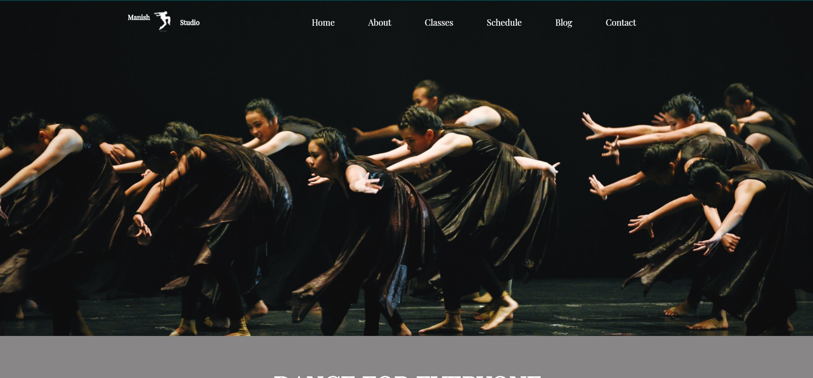

 For full Website: www.manistonk.com

This is a web development project for **Dance Academy** which contains home section and contact section only.
A preson can get information regarding dance academy on home section and contact section contains form which is very useful during admission.

The tools used in this project is listed below:
1. HTML  for frontend.
2. CSS for frontend.
3. NodeJS (Express) for Backend.
4. MongoDB for data collection and management.
5. VS Code as IDE.
